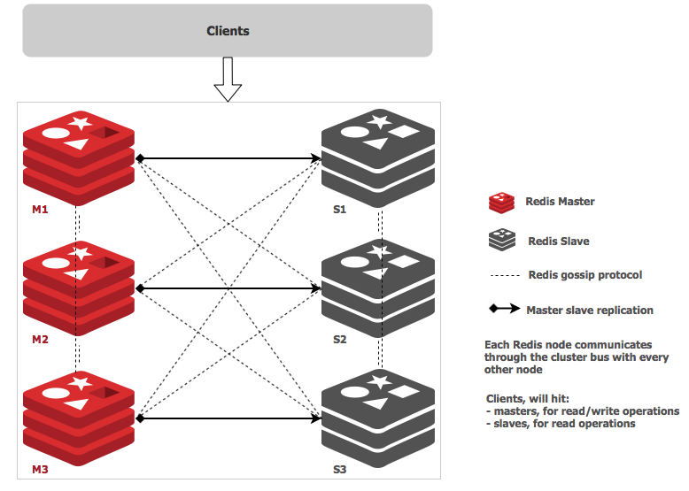
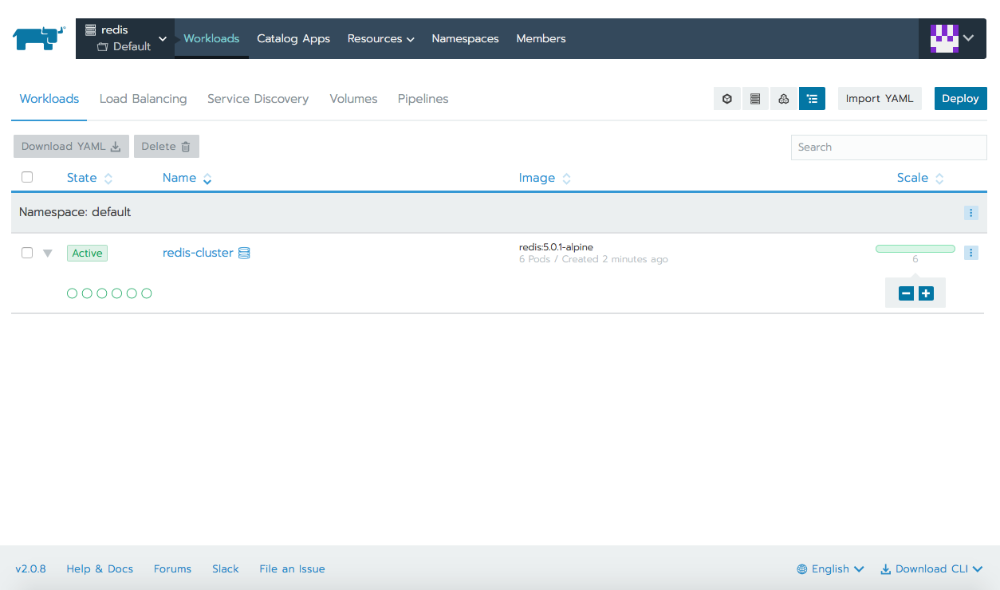
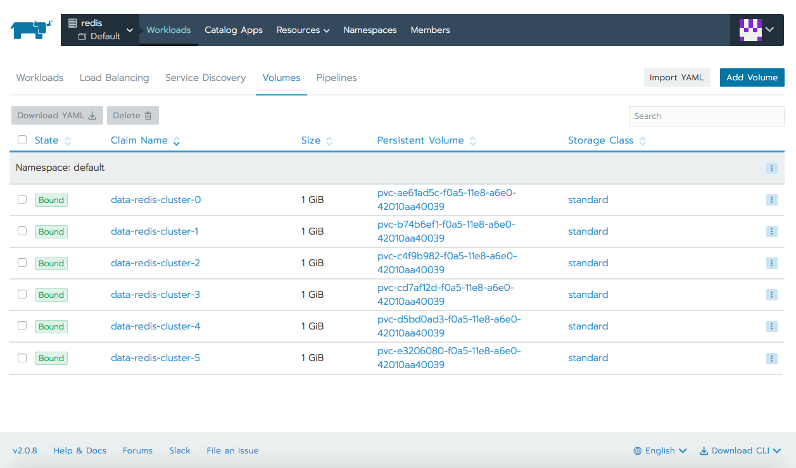
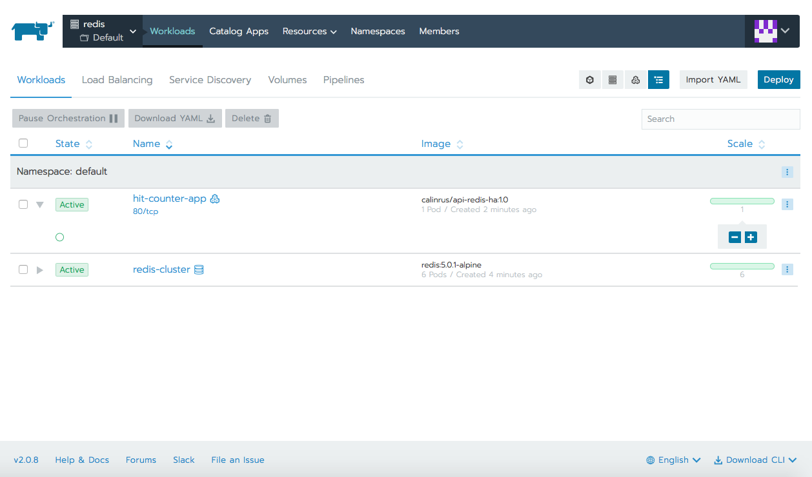
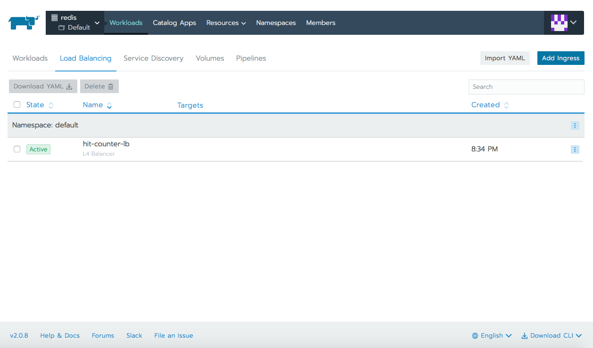
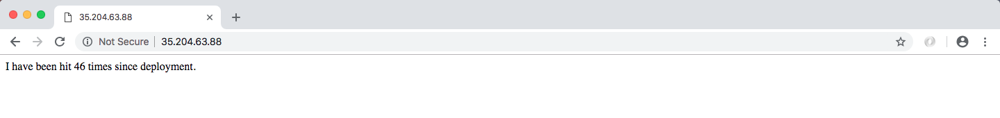
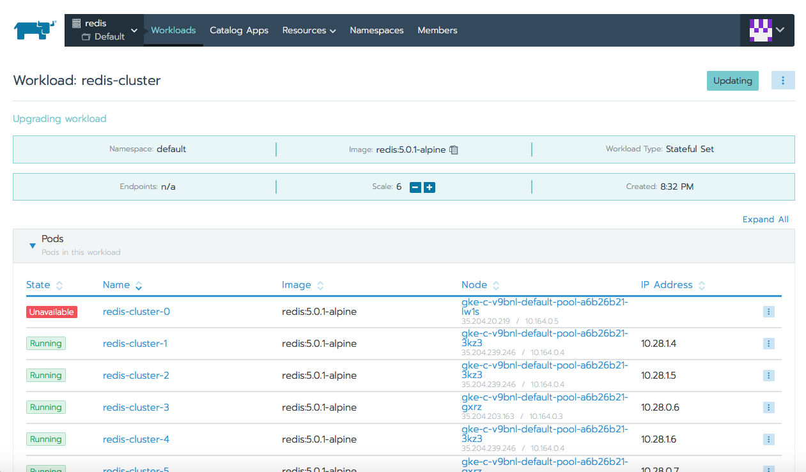

## Introduction
[Redis](https://redis.io) (REmote DIctionary Server) is an open source (BSD licensed), in-memory data structure store, used as a database, cache and message broker. It can store and manipulate high-level data types like lists, maps, sets, and sorted sets. Because Redis can accept keys in a wide range of formats, operations can be executed on the server and reduce the client's workload. Also it holds its database entirely in memory, using the disk only for persistence. Redis is so popular being highly used by tech giants like GitHub, Pinterest, Snapchat, Twitter, StackOverflow, Flickr and many more.

**Why use Redis?**
- It is incredibly fast (written in ANSI C and runs on POSIX systems such as Linux, Mac OS X and Solaris).
- Often ranked the most popular key-value database and the most popular NoSQL database in containers.
- Helps you save cloud database calls using caching solution.
- It can be accessed by applications through its client API library.
- Supported in most of the languages like JavaScript, Java, Go, C, C++, C#, Python, Objective-C, PHP.
- It is open source and stable

**Real examples of use cases**
- some Facebook online games have a very high number of score updates, these operations are trivial using a Redis sorted set, even if there are millions of users and millions of new scores per minute.
- Twitter stores the timeline for all users with a Redis cluster
- Pinterest stores the user follower graphs in a Redis cluster where data is sharded across hundreds of instances
- Github, uses the queueing solution from Redis

## About Redis Cluster
[Redis Cluster](https://redis.io/topics/cluster-tutorial) is a set of Redis instances, designed for scaling a database by partitioning it, hence making it more resilient. Each member in the cluster, whether a primary or a secondary replica, manages a subset of the hash slot. If a master becomes unreachable then its slave will be promoted to master. In a minimal Redis Cluster made up of 3 master nodes each wigh a single slave node (to allow minimal fail-over), each master node is assigned a hash slot range between 0 and 16,383. Node A will contain hash slots from 0 to 5000, node B from 5001 to 10000, node C from 10001 to 16383. Communication inside the cluster is made via an internal bus, using a gossip protocol in order to propagate information about the cluster or to discover new nodes. 



## Deploying Redis Cluster in Kubernetes

Getting Redis Cluster to work in [Kubernetes](https://kubernetes.io/docs/concepts/overview/what-is-kubernetes/) has its challenges as each Redis instance relies on a configuration file that keeps track of other cluster instances and their roles. For this we need a combination of Kubernetes’ [StatefulSets](https://kubernetes.io/docs/concepts/workloads/controllers/statefulset/) and [PersistentVolumes](https://kubernetes.io/docs/concepts/storage/persistent-volumes/).

### Prerequisites
To perform this demo you will need the following:
- a Google Cloud Platform account, the free tier provided is more than enough (any other cloud should work the same)
- [Rancher](https://rancher.com)
- Kubernetes cluster running on Google Kubernetes Engine (running EKS or AKS should be the same)

### Starting a Rancher 2.0 instance
To begin, start a Rancher 2.0 instance. There is a very intuitive getting started guide for this purpose [here](https://rancher.com/quick-start/).

### Using Rancher to deploy a GKE cluster
Use Rancher to set up and configure your Kubernetes cluster, follow the how-to [guide](https://rancher.com/docs/rancher/v2.x/en/cluster-provisioning/hosted-kubernetes-clusters/gke/).

We will need a VM (can be the same with the one hosting our Rancher instance) with `Google Cloud SDK` and `kubelet` installed. Make sure that gcloud has access to the Cloud Platform with Google user credentials (`gcloud init` and `gcloud auth login`).
As soon as cluster is deployed from Rancher UI, we can check basic kubectl commands.

```bash
$ kubectl get nodes
NAME                                     STATUS   ROLES    AGE   VERSION
gke-c-8dcng-default-pool-08c0a15c-2gpw   Ready    <none>   1h    v1.11.2-gke.18
gke-c-8dcng-default-pool-08c0a15c-4q79   Ready    <none>   1h    v1.11.2-gke.18
gke-c-8dcng-default-pool-08c0a15c-g9zv   Ready    <none>   1h    v1.11.2-gke.18
```

Let's now deploy Redis Cluster, either using `kubectl` to apply the yaml files, or importing them in Rancher's UI.

redis-sts.yaml:
```yaml
---
apiVersion: v1
kind: ConfigMap
metadata:
  name: redis-cluster
data:
  update-node.sh: |
    #!/bin/sh
    REDIS_NODES="/data/nodes.conf"
    sed -i -e "/myself/ s/[0-9]\{1,3\}\.[0-9]\{1,3\}\.[0-9]\{1,3\}\.[0-9]\{1,3\}/${POD_IP}/" ${REDIS_NODES}
    exec "$@"
  redis.conf: |+
    cluster-enabled yes
    cluster-require-full-coverage no
    cluster-node-timeout 15000
    cluster-config-file /data/nodes.conf
    cluster-migration-barrier 1
    appendonly yes
    protected-mode no
---
apiVersion: apps/v1
kind: StatefulSet
metadata:
  name: redis-cluster
spec:
  serviceName: redis-cluster
  replicas: 6
  selector:
    matchLabels:
      app: redis-cluster
  template:
    metadata:
      labels:
        app: redis-cluster
    spec:
      containers:
      - name: redis
        image: redis:5.0.1-alpine
        ports:
        - containerPort: 6379
          name: client
        - containerPort: 16379
          name: gossip
        command: ["/conf/update-node.sh", "redis-server", "/conf/redis.conf"]
        env:
        - name: POD_IP
          valueFrom:
            fieldRef:
              fieldPath: status.podIP
        volumeMounts:
        - name: conf
          mountPath: /conf
          readOnly: false
        - name: data
          mountPath: /data
          readOnly: false
      volumes:
      - name: conf
        configMap:
          name: redis-cluster
          defaultMode: 0755
  volumeClaimTemplates:
  - metadata:
      name: data
    spec:
      accessModes: [ "ReadWriteOnce" ]
      resources:
        requests:
          storage: 1Gi
```

redis-svc.yaml:
```yaml
---
apiVersion: v1
kind: Service
metadata:
  name: redis-cluster
spec:
  type: ClusterIP
  ports:
  - port: 6379
    targetPort: 6379
    name: client
  - port: 16379
    targetPort: 16379
    name: gossip
  selector:
    app: redis-cluster
```

```bash
$ kubectl apply -f redis-sts.yaml 
configmap/redis-cluster created
statefulset.apps/redis-cluster created

$ kubectl apply -f redis-svc.yaml 
service/redis-cluster created
```

Check that Redis nodes are up and running. You can check the same using Rancher.

```bash
$kubectl get pods
NAME                               READY   STATUS    RESTARTS   AGE
redis-cluster-0                    1/1     Running   0          7m
redis-cluster-1                    1/1     Running   0          7m
redis-cluster-2                    1/1     Running   0          6m
redis-cluster-3                    1/1     Running   0          6m
redis-cluster-4                    1/1     Running   0          6m
redis-cluster-5                    1/1     Running   0          5m
```

```bash
$ kubectl get pv
NAME                                       CAPACITY   ACCESS MODES   RECLAIM POLICY   STATUS   CLAIM                          STORAGECLASS   REASON   AGE
pvc-ae61ad5c-f0a5-11e8-a6e0-42010aa40039   1Gi        RWO            Delete           Bound    default/data-redis-cluster-0   standard                7m
pvc-b74b6ef1-f0a5-11e8-a6e0-42010aa40039   1Gi        RWO            Delete           Bound    default/data-redis-cluster-1   standard                7m
pvc-c4f9b982-f0a5-11e8-a6e0-42010aa40039   1Gi        RWO            Delete           Bound    default/data-redis-cluster-2   standard                6m
pvc-cd7af12d-f0a5-11e8-a6e0-42010aa40039   1Gi        RWO            Delete           Bound    default/data-redis-cluster-3   standard                6m
pvc-d5bd0ad3-f0a5-11e8-a6e0-42010aa40039   1Gi        RWO            Delete           Bound    default/data-redis-cluster-4   standard                6m
pvc-e3206080-f0a5-11e8-a6e0-42010aa40039   1Gi        RWO            Delete           Bound    default/data-redis-cluster-5   standard                5m
```

```bash
$ kubectl describe pods redis-cluster-0 | grep pvc
  Normal  SuccessfulAttachVolume  29m   attachdetach-controller                          AttachVolume.Attach succeeded for volume "pvc-ae61ad5c-f0a5-11e8-a6e0-42010aa40039"
```





Now we need to form Redis Cluster. To do this, let's run the following command and type 'yes' to accept the configuration. We will see that first three nodes will be selected to be **master**, last three will be **slaves**.

```bash
$ kubectl exec -it redis-cluster-0 -- redis-cli --cluster create --cluster-replicas 1 $(kubectl get pods -l app=redis-cluster -o jsonpath='{range.items[*]}{.status.podIP}:6379 ')
>>> Performing hash slots allocation on 6 nodes...
Master[0] -> Slots 0 - 5460
Master[1] -> Slots 5461 - 10922
Master[2] -> Slots 10923 - 16383
Adding replica 10.60.1.13:6379 to 10.60.2.12:6379
Adding replica 10.60.2.14:6379 to 10.60.1.12:6379
Adding replica 10.60.1.14:6379 to 10.60.2.13:6379
M: 2847de6f6e7c8aaa8b0d2f204cf3ff6e8562a75b 10.60.2.12:6379
   slots:[0-5460] (5461 slots) master
M: 3f119dcdd4a33aab0107409524a633e0d22bac1a 10.60.1.12:6379
   slots:[5461-10922] (5462 slots) master
M: 754823247cf28af9a2a82f61a8caaa63702275a0 10.60.2.13:6379
   slots:[10923-16383] (5461 slots) master
S: 47efe749c97073822cbef9a212a7971a0df8aecd 10.60.1.13:6379
   replicates 2847de6f6e7c8aaa8b0d2f204cf3ff6e8562a75b
S: e40ae789995dc6b0dbb5bb18bd243722451d2e95 10.60.2.14:6379
   replicates 3f119dcdd4a33aab0107409524a633e0d22bac1a
S: 8d627e43d8a7a2142f9f16c2d66b1010fb472079 10.60.1.14:6379
   replicates 754823247cf28af9a2a82f61a8caaa63702275a0
Can I set the above configuration? (type 'yes' to accept): yes
>>> Nodes configuration updated
>>> Assign a different config epoch to each node
>>> Sending CLUSTER MEET messages to join the cluster
Waiting for the cluster to join
....
>>> Performing Cluster Check (using node 10.60.2.12:6379)
M: 2847de6f6e7c8aaa8b0d2f204cf3ff6e8562a75b 10.60.2.12:6379
   slots:[0-5460] (5461 slots) master
   1 additional replica(s)
S: 47efe749c97073822cbef9a212a7971a0df8aecd 10.60.1.13:6379
   slots: (0 slots) slave
   replicates 2847de6f6e7c8aaa8b0d2f204cf3ff6e8562a75b
M: 754823247cf28af9a2a82f61a8caaa63702275a0 10.60.2.13:6379
   slots:[10923-16383] (5461 slots) master
   1 additional replica(s)
M: 3f119dcdd4a33aab0107409524a633e0d22bac1a 10.60.1.12:6379
   slots:[5461-10922] (5462 slots) master
   1 additional replica(s)
S: e40ae789995dc6b0dbb5bb18bd243722451d2e95 10.60.2.14:6379
   slots: (0 slots) slave
   replicates 3f119dcdd4a33aab0107409524a633e0d22bac1a
S: 8d627e43d8a7a2142f9f16c2d66b1010fb472079 10.60.1.14:6379
   slots: (0 slots) slave
   replicates 754823247cf28af9a2a82f61a8caaa63702275a0
[OK] All nodes agree about slots configuration.
>>> Check for open slots...
>>> Check slots coverage...
[OK] All 16384 slots covered.
```

**Optional** we can check cluster details and the role for each of the members.

<details><summary>Click for full command output</summary>

```bash
$ kubectl exec -it redis-cluster-0 -- redis-cli cluster info
cluster_state:ok
cluster_slots_assigned:16384
cluster_slots_ok:16384
cluster_slots_pfail:0
cluster_slots_fail:0
cluster_known_nodes:6
cluster_size:3
cluster_current_epoch:6
cluster_my_epoch:1
cluster_stats_messages_ping_sent:41
cluster_stats_messages_pong_sent:41
cluster_stats_messages_sent:82
cluster_stats_messages_ping_received:36
cluster_stats_messages_pong_received:41
cluster_stats_messages_meet_received:5
cluster_stats_messages_received:82

$ kubectl exec -it redis-cluster-0 -- redis-cli role
1) "master"
2) (integer) 56
3) 1) 1) "10.60.1.13"
      2) "6379"
      3) "56"

$ kubectl exec -it redis-cluster-1 -- redis-cli role
1) "master"
2) (integer) 70
3) 1) 1) "10.60.2.14"
      2) "6379"
      3) "70"

$ kubectl exec -it redis-cluster-2 -- redis-cli role
1) "master"
2) (integer) 70
3) 1) 1) "10.60.1.14"
      2) "6379"
      3) "70"

$ kubectl exec -it redis-cluster-3 -- redis-cli role
1) "slave"
2) "10.60.2.12"
3) (integer) 6379
4) "connected"
5) (integer) 84

$ kubectl exec -it redis-cluster-4 -- redis-cli role
1) "slave"
2) "10.60.1.12"
3) (integer) 6379
4) "connected"
5) (integer) 98

$ kubectl exec -it redis-cluster-5 -- redis-cli role
1) "slave"
2) "10.60.2.13"
3) (integer) 6379
4) "connected"
5) (integer) 98
```
</details></br>

## Testing Redis cluster

Now that we have Redis cluster up and running let's test it. For this we will use a simple Restul API written in Python and using Redis. Its only purpose is to count the number of hits a webpage has received.

**Optional:** script can be modified hence the image will need to be rebuilt, otherwise we can skip the above steps.

<details><summary>Build new image is optional. Click for full command output.</summary>

Dockerfile:
```bash
FROM python:2-alpine

WORKDIR /usr/src/app

COPY requirements.txt ./
RUN pip install --no-cache-dir -r requirements.txt

COPY . .

CMD [ "python", "./app.py" ]
```

requirements.txt:
```bash
flask
redis-py-cluster
```

app.py:
```python
from rediscluster import StrictRedisCluster
import time
from flask import Flask


app = Flask(__name__)
startup_nodes = [{"host": "redis-cluster", "port": "6379"}]
cache = StrictRedisCluster(startup_nodes=startup_nodes, decode_responses=True)


def get_hit_count():
    return cache.incr('hits')


@app.route('/')
def hit():
    count = get_hit_count()
    return 'I have been hit %i times since deployment.\n' % int(count)


if __name__ == "__main__":
    app.run(host="0.0.0.0", debug=True)
```

```bash
$ docker build -t api-redis-ha:1.0 . 
Sending build context to Docker daemon 4.096 kB
Step 1/6 : FROM python:2-alpine
 ---> f901fc789b69
Step 2/6 : WORKDIR /usr/src/app
 ---> 280510654b63
Removing intermediate container 8bf4d602093e
Step 3/6 : COPY requirements.txt ./
 ---> 72744d5542cf
Removing intermediate container 90fe725796f0
Step 4/6 : RUN pip install --no-cache-dir -r requirements.txt
 ---> Running in 94b307a26ddc

Collecting flask (from -r requirements.txt (line 1))
  Downloading https://files.pythonhosted.org/packages/7f/e7/08578774ed4536d3242b14dacb4696386634607af824ea997202cd0edb4b/Flask-1.0.2-py2.py3-none-any.whl (91kB)
Collecting redis-py-cluster (from -r requirements.txt (line 2))
  Downloading https://files.pythonhosted.org/packages/6d/02/b2458f900496d1e573ada7ffd882efe62aeee992eab1222411fe08aa5f75/redis-py-cluster-1.3.6.tar.gz
Collecting Werkzeug>=0.14 (from flask->-r requirements.txt (line 1))
  Downloading https://files.pythonhosted.org/packages/20/c4/12e3e56473e52375aa29c4764e70d1b8f3efa6682bef8d0aae04fe335243/Werkzeug-0.14.1-py2.py3-none-any.whl (322kB)
Collecting click>=5.1 (from flask->-r requirements.txt (line 1))
  Downloading https://files.pythonhosted.org/packages/fa/37/45185cb5abbc30d7257104c434fe0b07e5a195a6847506c074527aa599ec/Click-7.0-py2.py3-none-any.whl (81kB)
Collecting itsdangerous>=0.24 (from flask->-r requirements.txt (line 1))
  Downloading https://files.pythonhosted.org/packages/76/ae/44b03b253d6fade317f32c24d100b3b35c2239807046a4c953c7b89fa49e/itsdangerous-1.1.0-py2.py3-none-any.whl
Collecting Jinja2>=2.10 (from flask->-r requirements.txt (line 1))
  Downloading https://files.pythonhosted.org/packages/7f/ff/ae64bacdfc95f27a016a7bed8e8686763ba4d277a78ca76f32659220a731/Jinja2-2.10-py2.py3-none-any.whl (126kB)
Collecting redis==2.10.6 (from redis-py-cluster->-r requirements.txt (line 2))
  Downloading https://files.pythonhosted.org/packages/3b/f6/7a76333cf0b9251ecf49efff635015171843d9b977e4ffcf59f9c4428052/redis-2.10.6-py2.py3-none-any.whl (64kB)
Collecting MarkupSafe>=0.23 (from Jinja2>=2.10->flask->-r requirements.txt (line 1))
  Downloading https://files.pythonhosted.org/packages/ac/7e/1b4c2e05809a4414ebce0892fe1e32c14ace86ca7d50c70f00979ca9b3a3/MarkupSafe-1.1.0.tar.gz
Installing collected packages: Werkzeug, click, itsdangerous, MarkupSafe, Jinja2, flask, redis, redis-py-cluster
  Running setup.py install for MarkupSafe: started
    Running setup.py install for MarkupSafe: finished with status 'done'
  Running setup.py install for redis-py-cluster: started
    Running setup.py install for redis-py-cluster: finished with status 'done'
Successfully installed Jinja2-2.10 MarkupSafe-1.1.0 Werkzeug-0.14.1 click-7.0 flask-1.0.2 itsdangerous-1.1.0 redis-2.10.6 redis-py-cluster-1.3.6
 ---> 3f97fa25d052
Removing intermediate container 94b307a26ddc
Step 5/6 : COPY . .
 ---> 791b1d27ab29
Removing intermediate container 4f20eda6098e
Step 6/6 : CMD python ./app.py
 ---> Running in 9079ace2248d
 ---> 04aa98f8762b
Removing intermediate container 9079ace2248d
Successfully built 04aa98f8762b

$ docker tag api-redis-ha:1.0 calinrus/api-redis-ha:1.0

$ docker push calinrus/api-redis-ha:1.0
The push refers to a repository [docker.io/calinrus/api-redis-ha]
e657f12b6c32: Pushed 
cbd2dac22a1d: Pushed 
1af27c6cf8c3: Pushed 
eb67a0a5de10: Pushed 
342e4668db2a: Mounted from calinrus/hit-counter 
706f1d220052: Mounted from calinrus/hit-counter 
2c30600325be: Mounted from calinrus/hit-counter 
df64d3292fd6: Mounted from calinrus/hit-counter 
1.0: digest: sha256:77d63b96fcf61c364868545365dbb997fe4e5dcf0e3ceaee30709dd50ecf5e1c size: 1993
```
</details></br>


Let's deploy this in Kubernetes, again we can do this either with `kubectl` or by importing the Yaml file using Rancher's UI.

app-deployment-service.yaml:

```yaml
---
apiVersion: v1
kind: Service
metadata:
  name: hit-counter-lb
spec:
  type: LoadBalancer
  ports:
  - port: 80
    protocol: TCP
    targetPort: 5000
  selector:
      app: myapp
---
apiVersion: apps/v1
kind: Deployment
metadata:
  name: hit-counter-app
spec:
  replicas: 1
  selector:
    matchLabels:
      app: myapp
  template:
    metadata:
      labels:
        app: myapp
    spec:
      containers:
      - name: myapp
        image: calinrus/api-redis-ha:1.0
        ports:
        - containerPort: 5000
```

```bash
$ kubectl apply -f app-deployment-service.yaml 
service/hit-counter-lb created
deployment.apps/hit-counter-app created
```

As soon as hit-counter-lb Service is up and we have a public IP address assigned we can start hitting it. The request is going to call our python script and this, using a library, will connect to Redis and increase a key called `hits` and then return it as response.





Now, as we saw the Redis key increasing with every hit, let's try bring one of the master nodes down. We will see how `redis-cluster-0` previously as master, will turn into slave, and its slave, `redis-cluster-3` will become master. Now try to hit again the public IP, you will see that the number of hits is kept and data was not lost.

**Before:**
```bash
$ kubectl describe pods redis-cluster-0 | grep IP
IP:                 10.28.0.5
      POD_IP:   (v1:status.podIP)

$ kubectl describe pods redis-cluster-3 | grep IP
IP:                 10.28.0.6
      POD_IP:   (v1:status.podIP)

$ kubectl exec -it redis-cluster-0 -- redis-cli role
1) "master"
2) (integer) 1859
3) 1) 1) "10.28.0.6"
      2) "6379"
      3) "1859"

$ kubectl exec -it redis-cluster-3 -- redis-cli role
1) "slave"
2) "10.28.0.5"
3) (integer) 6379
4) "connected"
5) (integer) 1859
```
Bringing down a node and checking to see how roles have changed for the two master-slave pair.



**After:**
```bash
$ kubectl exec -it redis-cluster-0 -- redis-cli role
1) "slave"
2) "10.28.0.6"
3) (integer) 6379
4) "connected"
5) (integer) 2111

$ kubectl exec -it redis-cluster-3 -- redis-cli role
1) "master"
2) (integer) 2111
3) 1) 1) "10.28.2.12"
      2) "6379"
      3) "2111"
```

You can see here, in the last command, the IP for `redis-cluster-0` node has changed. Previously was `10.28.0.5`, now it is `10.28.2.12`. If you remember few lines above, we were saying that Redis relies on a configuration file that keeps track of other cluster instances and their roles. So, how did the cluster remain up and running since the role and the IP changed? Simple, in our `configMap` we have a script that automatically replaces the old IP for the node with its new one, this way our cluster is not impacted for any node failure.
So, we can check the public IP for our python app, hit it few times and can see the counter didn't reset but resumed from previously stored value.


## Conclusion

Redis is such a powerfull tool and Redis cluster, which is a distributed implementation of the first adds some extra goals to this already great product. We have now higher performance, linear scalability and better availability due to this cluster architecture. Our data is automatically split among multiple nodes and we have now the ability to continue operations when a subset of the nodes are experiencing failures or are unable to communicate with the rest of the cluster.
We saw how to deploy Redis Cluster on Kubernetes with the help of [Rancher](https://rancher.com), also we tested a basic scenario to see that we have a working environment.
If you need more information on Redis Cluster, don't hesitate check the great official documentation available [here](https://redis.io/topics/cluster-tutorial) or [here](https://redis.io/topics/cluster-spec).
